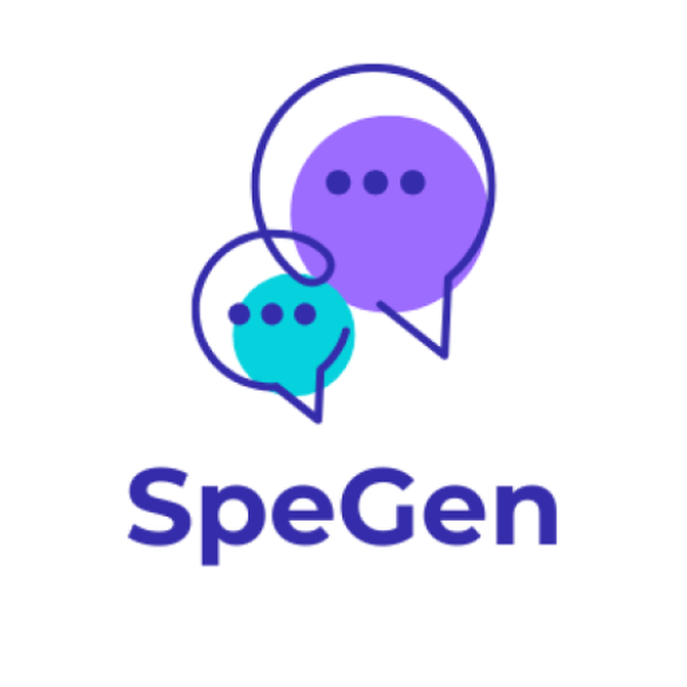

<!-- PROJECT SHIELDS -->
<!--
*** Markdown "reference style" links are used for readability.
*** Reference links are enclosed in brackets [ ] instead of parentheses ( ).
*** See the bottom of this document for the declaration of the reference variables.
-->
[![Contributors][contributors-shield]][contributors-url]
[![Forks][forks-shield]][forks-url]
[![Stargazers][stars-shield]][stars-url]
[![Issues][issues-shield]][issues-url]
[![Commits][commits-shield]][commits-url]

<!-- PROJECT LOGO -->
 

  

<h3 align="center">SpeGen</h3>

  

    A free, cross-platform AAC app built to be useful and intuitive — on Android and the web, with iOS coming soon.
     
     
    <a href="https://spegen.vercel.app/"><strong> Try the web app »</strong></a>
     
     
    <a href="https://github.com/hkleinkeane/SpeGen/issues/new?labels=bug&template=bug-report---.md">Report Bug</a>
    &middot;
    <a href="https://github.com/hkleinkeane/SpeGen/issues/new?labels=enhancement&template=feature-request---.md">Request Feature</a>
  

<!-- PLATFORM BADGES -->

<!-- TABLE OF CONTENTS -->

  
Table of Contents

  <ol>
    <li><a href="#about-the-project">About The Project</a></li>
    <li><a href="#platforms">Platforms</a></li>
    <li><a href="#built-with">Built With</a></li>
    <li><a href="#roadmap">Roadmap</a></li>
    <li><a href="#contributing">Contributing</a></li>
    <li><a href="#contact">Contact</a></li>
    <li><a href="#acknowledgments">Acknowledgments</a></li>
  </ol>

<!-- ABOUT THE PROJECT -->
## About The Project

SpeGen is a free, open-source AAC (augmentative and alternative communication) app in active development. The goal is to create a budget-friendly, accessible app that anyone can use to communicate. It began as a native Android app and is now cross-platform — the same app runs on Android and in the browser, with an iOS version coming soon.

SpeGen is licensed under the GNU General Public License v3.0.

- Try it now in your browser: [spegen.vercel.app](https://spegen.vercel.app/)
- If you want to support development as an AAC user or a caretaker of someone who uses an AAC device or app — without directly contributing or testing — check out [this form].
- If you're interested in testing SpeGen, add your email to [this linked form] and I'll contact you with further instructions. The more people that test, the better. Once I reach a certain number of testers, I'll be able to push the app onto the Google Play store which should help the app reach a wider audience.

<!-- PLATFORMS -->
## Platforms

| Platform | Status | How to get it |
| --- | --- | --- |
|  Web | **Live** | Open [spegen.vercel.app](https://spegen.vercel.app/) in any modern browser |
|  Android | **Supported** | Sideload the APK or join testing via [this linked form] |
|  iOS | **Coming soon** | Unrealeased as of now. For those on iOS/iPadOS, you can add the web page to your device to work like a native application by hitting the share button when you are on the website and pressing the add to home screen button. |

<!-- BUILT WITH -->
## Built With

One codebase that is shared across Android, web, and (soon) iOS:

- [Expo](https://expo.dev/) (React Native, SDK 56)
- [React Native Web](https://necolas.github.io/react-native-web/) for the browser build
- TypeScript
- Symbols from [OpenSymbols](https://www.opensymbols.org/)

<!-- ROADMAP -->
## Roadmap

- [x] Native Android app
- [x] Cross-platform rewrite (Expo / React Native)
- [x] Web app — live at [spegen.vercel.app](https://spegen.vercel.app/)
- [x] Light / dark / system themes
- [ ] iOS release
- [ ] Continued vocabulary & word-prediction improvements

Note: features are actively being worked on that may not be listed above. See the [open issues](https://github.com/hkleinkeane/SpeGen/issues) for a full list of proposed features (and known issues).

<!-- CONTRIBUTING -->
## Contributing

Contributions are what make the open source community such an amazing place to learn, inspire, and create. Any contributions you make are **greatly appreciated**.

If you have a suggestion that would make this better, please fork the repo and create a pull request. You can also simply open an issue with the tag "enhancement".
Don't forget to give the project a star! Thanks again!

1. Fork the Project
2. Create your Feature Branch (`git checkout -b feature/AmazingFeature`)
3. Commit your Changes (`git commit -m 'Add some AmazingFeature'`)
4. Push to the Branch (`git push origin feature/AmazingFeature`)
5. Open a Pull Request

### Top contributors:

<!-- CONTACT -->
## Contact

Email - harperkleinkeane@gmail.com

Web app: [https://spegen.vercel.app/](https://spegen.vercel.app/)

Project Link: [https://hkleinkeane.github.io/spegen/](https://hkleinkeane.github.io/spegen/)

<!-- ACKNOWLEDGMENTS -->
## Acknowledgments

* [Madirish2600] - For teaching me everything I know about programming
* [OpenSymbols](https://www.opensymbols.org/) - Open symbol library used for all item pictures in the app

<!-- MARKDOWN LINKS & IMAGES -->

[this form]: https://forms.gle/1LsHpvnRj59wychY8

[this linked form]: https://forms.gle/ZGtSkEEU4KPwapoh9

[Madirish2600]: https://github.com/madirish

<!-- https://www.markdownguide.org/basic-syntax/#reference-style-links -->
[contributors-shield]: https://img.shields.io/github/contributors/hkleinkeane/SpeGen.svg?style=for-the-badge
[contributors-url]: https://github.com/hkleinkeane/SpeGen/graphs/contributors
[forks-shield]: https://img.shields.io/github/forks/hkleinkeane/SpeGen.svg?style=for-the-badge
[forks-url]: https://github.com/hkleinkeane/SpeGen/network/members
[stars-shield]: https://img.shields.io/github/stars/hkleinkeane/SpeGen.svg?style=for-the-badge
[stars-url]: https://github.com/hkleinkeane/SpeGen/stargazers
[issues-shield]: https://img.shields.io/github/issues/hkleinkeane/SpeGen.svg?style=for-the-badge
[issues-url]: https://github.com/hkleinkeane/SpeGen/issues
[commits-shield]: https://img.shields.io/github/commit-activity/t/hkleinkeane/SpeGen.svg?style=for-the-badge
[commits-url]: https://github.com/hkleinkeane/SpeGen/graphs/commit-activity
